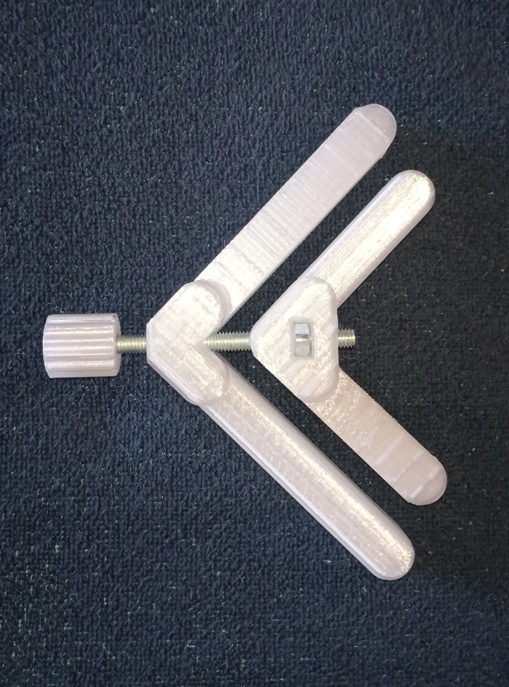

Design parameters like clamp angle and bolt size can be changed in the OpenSCAD customizer. The gap between metallic and plastic parts is controlled by 'clearance' parameter. Clamps on screenshots were printed with PETG and a layer height of 0.2mm.

This project was inspired by [Right angle clamp](https://www.thingiverse.com/thing:6565057) by stenokit.
